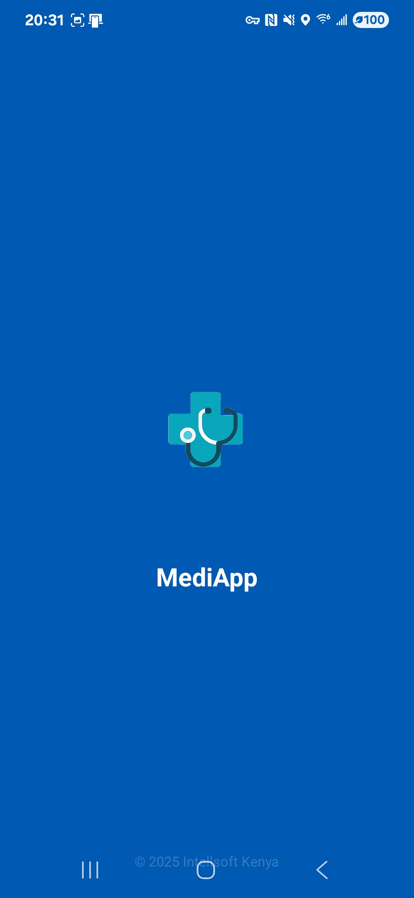
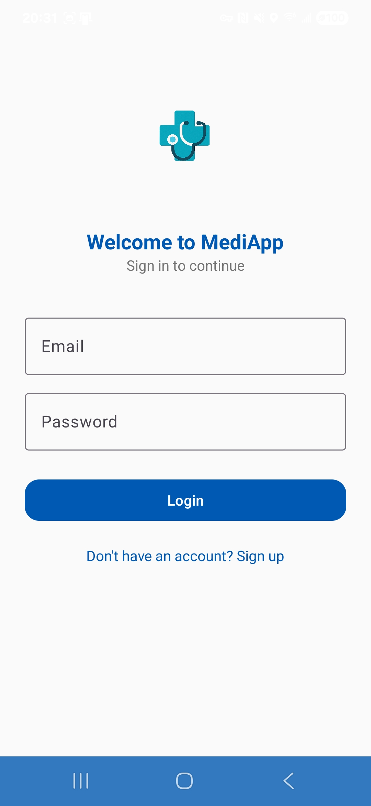
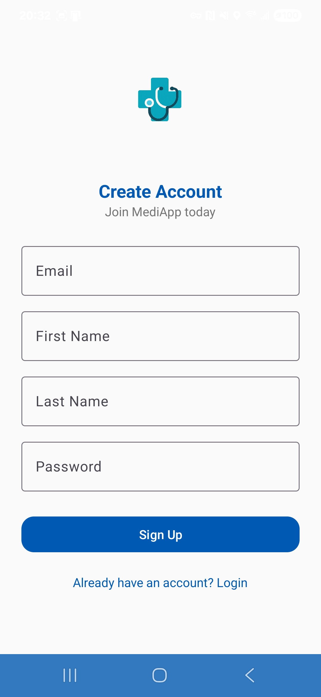
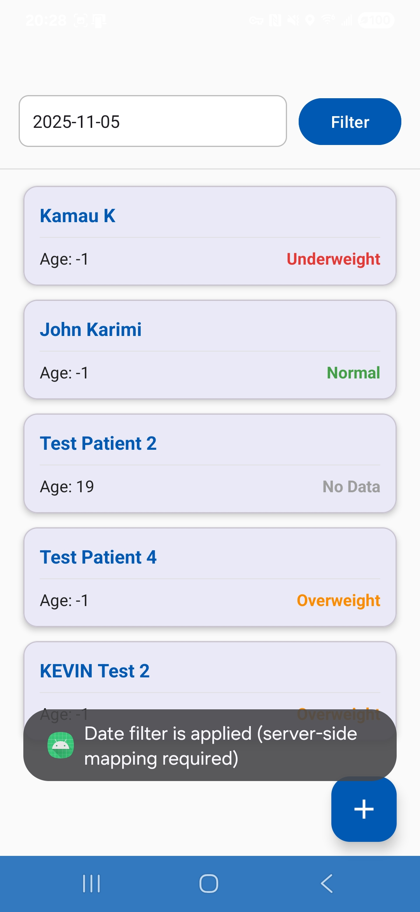
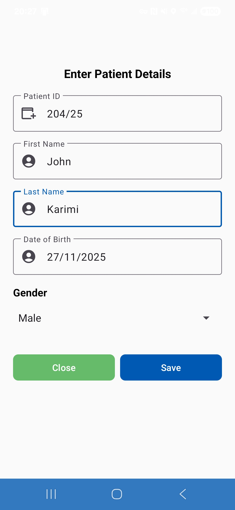
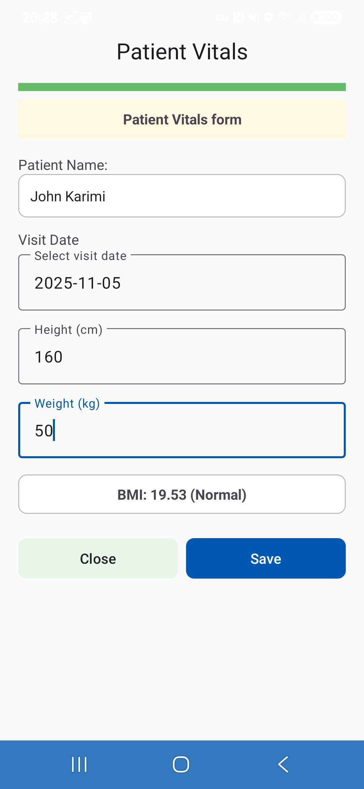
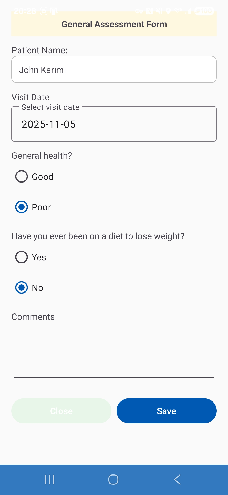

# 🩺 MediApp  Patient Registration & Assessment System

**MediApp** is an Android mobile application that enables healthcare workers to **register patients**, record **vitals (height, weight, BMI)**, and complete **General** and **Overweight** health assessments.  
The app works both **offline (Room database)** and **online (API sync)**,  ensuring reliable data capture and synchronization.

---

## 📱 Screenshots

## 📱 Screenshots

| Patient Listing                             | Add Vitals                                  | Assessment Form                             |
|---------------------------------------------|---------------------------------------------|---------------------------------------------|
|  |  |  |
|  |  |  |
|  |  |                                             |

---

## 🔗 Download APK

📦 **[Download MediApp v1.0 (APK)](screenshots/mediapp.apk)**
---

## 🚀 Features

- 👩‍⚕️ **Patient Registration** with unique ID, DOB, gender, and names
- 📏 **Vitals Recording** (Height, Weight, BMI auto-calculated)
- 🧮 **BMI Status Logic**
    - Underweight (BMI < 18.5)
    - Normal (18.5 ≤ BMI < 25)
    - Overweight (BMI ≥ 25)
- 📝 **General and Overweight Assessment Forms**
- 🧠 **Offline-first architecture** with Room database
- 🌐 **Automatic background sync** when connected
- 🔐 **User Login & Token-based Authentication**
- 🎨 **Modern Material UI** with color-coded BMI statuses

---

## 🧩 Tech Stack

| Component | Technology |
|------------|-------------|
| Language | Java |
| Architecture | MVVM (Model–View–ViewModel) |
| UI | Material Design Components |
| Local Storage | Room Persistence Library |
| Networking | Retrofit + OkHttp |
| JSON Parsing | Gson |
| Auth | JWT Token via SharedPreferences |
| Background Jobs | ExecutorService + Repository Pattern |

---

## 🏗️ Project Structure
kevin.intellsoft.mediapp/
│
├── data/
│ ├── local/ # Room database, entities, DAO
│ ├── network/ # Retrofit API interfaces
│ ├── repository/ # Repositories (Patient, Vital, Assessment)
│
├── ui/
│ ├── auth/ # Login & Registration
│ ├── patient/ # Listing, Details, Adapter
│ ├── vitals/ # Vitals entry screen
│ ├── assessment/ # General & Overweight forms
│
├── util/ # Helpers (AuthManager, DateUtils)
└── res/ # Layouts, Drawables, Colors, etc.
## ⚙️ Running Instructions

Follow these steps to build and run **MediApp** locally:

### 🧰 1. Clone the repository
```bash
git clone https://github.com/kev254/MediApp.git
cd MediApp
